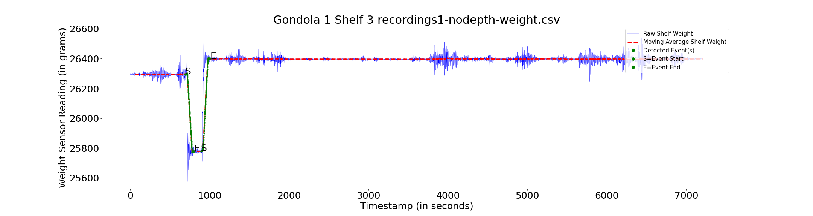
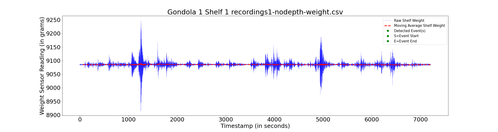

# Python Data Vizualization

Aifi Store is autonomus store for cashierless shopping experience this is achieved by multi modal sensing (Vision modality, weight modality and location modality).
 

This repository helps you plot and vizualize the weight sensor data and moving average from csv files from the AiFi store.
 

   
  <em>AIFI Nano store layout</em>
   
  

  <em>Image Credits <a href="https://dl.acm.org/doi/10.1145/3360322.3361018" target="_blank">AIM3S paper</a></em>
  

 

  Gondola is similar to vertical fixture consisting of horizontal shelfs in any normal store and in this case there are 5 to 6 shelfs in a Gondola  
  Every shelf again is composed of weight sensing plates, weight sensing modalities, there are around 12 plates on each shelf 
  Every plate has a sampling rate of **60Hz**, so there are 60 samples collected every second from each plate  
  The pick up event on the plate can be observed and marked when the weight sensor reading decreases with time and increases with time when the put down event happens. 
  
  Pick Up Event = Object being taken from the particular gondola and shelf from the customer 
  

   
  <em>Example Pick Up Event Graph</em>
   

 
Put Down Event = Object being placed back from the customer on that particular gondola and shelf  

   
  <em>Example Put Down Event Graph</em>
   

NO Event = No object being picked up from that shelf  
  

   
  <em>Example No Event Graph</em>
   

 
  

### NOTE:
The python script must be in the same folder as of the weight.csv files and .csv files should not be placed in other subdirectories  
### Details of the weight sensor files:

  These weight.csv (Baseline cases) files are from the AIFI CPS IoT 2020 week.There are 10 cases in total and each file has 5 columns (timestamp,reading(in grams),gondola,shelf,plate number) 
  

   
  <em>Snapshot of weight.csv file</em>
   

 
Each of these files have data of around 2 minutes or 120 seconds in the form of timestamp. In order to unpack date and time from timestamp use datetime module from python.

# Instruction to run the script
To start analysing the weigh.csv files using the python script and plot the timeseries plot for corresponding files.
1. Clone the repository 
`$ git clone https://github.com/Rahul664/Analysis_plots.git` 
2. Change the directory to cloned repository 
`$ cd Analysis_plots` 
3. Install the requirements  
`$ pip3 install -r requirements.txt` 
4. Run the python script Plot.py 
`$ python3 Plot.py` 

After the script has run successfully you will find the corresponding folders of weight.csv files which contain the figures (weight vs timestamp) in the format  
--------------------------------- --------------------------------- --------------------------------- -------------------------------  

gondola_number,shelf_number.png    

Ex: 1,1.png 

   
  <em>Timeseries Graph</em>
   

--------------------------------- --------------------------------- --------------------------------- -------------------------------  
